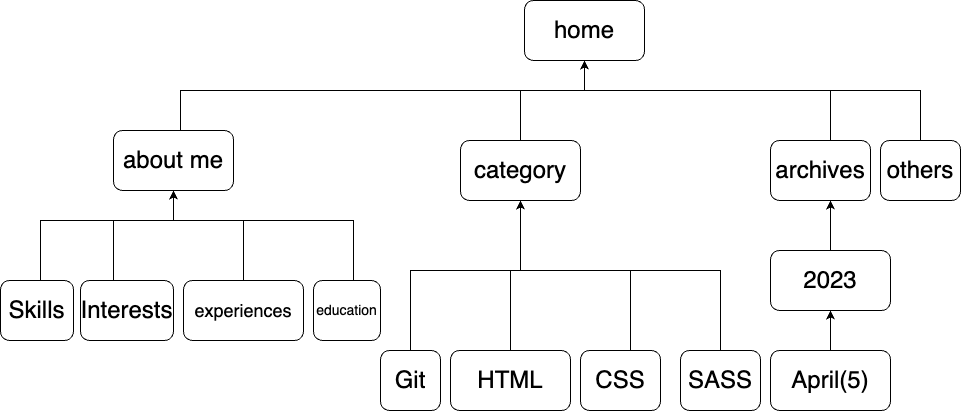

# Portfolio 

[Demo](https://meek-stardust-f1f3d2.netlify.app/)

[Git_Repo](https://github.com/elle-n-lu/portfolio)

[Presentation_link](https://youtu.be/A4D8OvuLWPE)

This website is to serve as an online resume as a programmer, and also to record some knowledge points in the process of learning programming, as well as the daily landscape photos taken by myself.

### § Features
author introduction
blogs
photos in life

### § Sitemap

### § Screenshots

